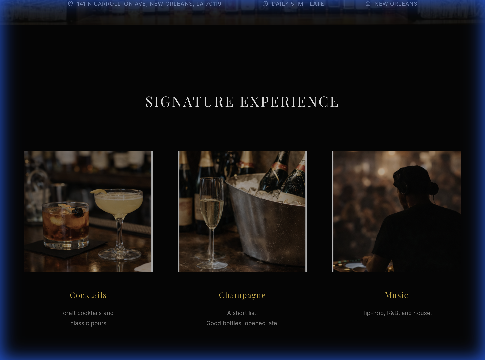
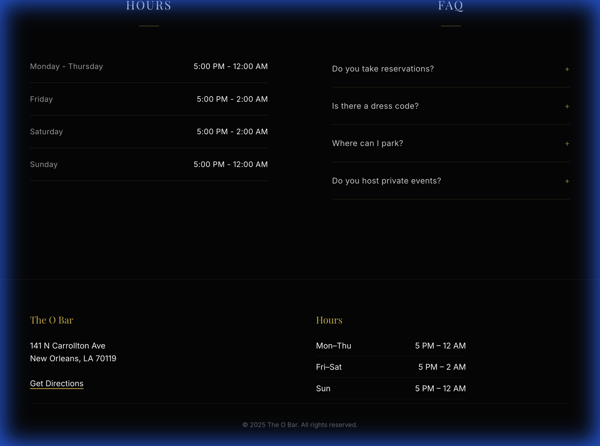
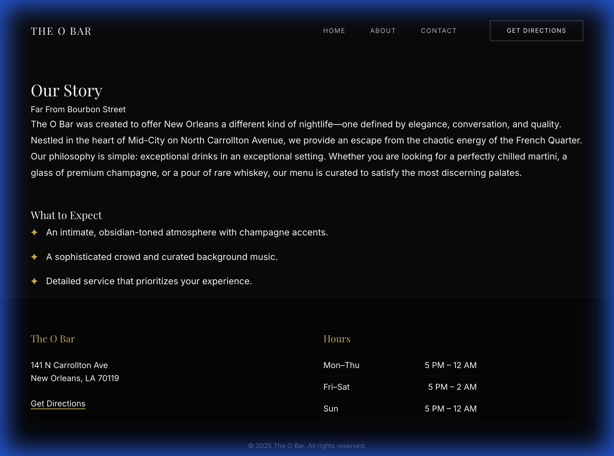
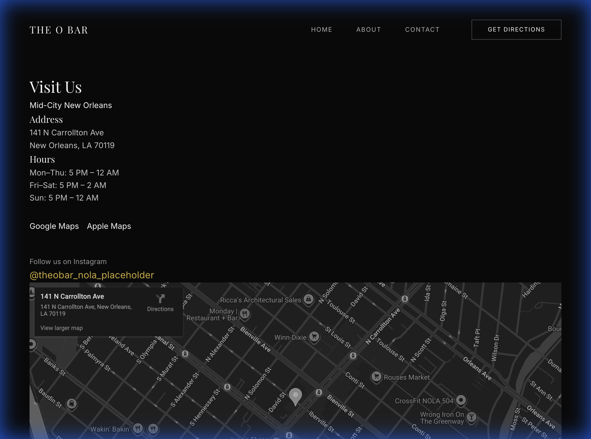

# The O Bar - Design Review Package

**Date:** 2025-12-20
**Status:** Production Candidate (Hard Lock Applied)

This folder contains the complete visual archive of the site. You can zip this entire folder and send it to your team.

## 1. Home Page
 The primary landing experience, polished for a "calm, confident, restrained, and expensive" aesthetic.

### Hero Section
*Strict overlay, refined typography, reduced noise.*

### Signature Experience
*Hard-locked copy: "craft cocktails and classic pours", "Hip-hop, R&B, and house".*

### Hours & Info
*Clean, minimal, high-contrast.*

### Footer
*Quiet, essential information only.*

---

## 2. Secondary Pages

### About Page

### Contact Page

